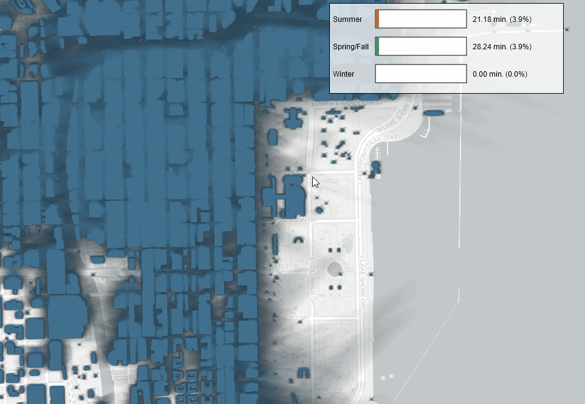

# Shadow Accrual Maps

This project aims to visualize the spatial distribution of accumulated shadows in Chicago for different seasons of the year. It provides an interactive web application that allows users to explore shadow patterns across the city, offering insights into how sunlight and shadows affect urban areas throughout the year.

## Tools and Technologies Used
- Angular
- TypeScript
- D3.js
- OpenLayers
- HTML/CSS



## Components

### 1. OpenLayers Map

- An interactive map centered on Chicago
- Uses OpenLayers with a TileLayer (e.g., OpenStreetMap)
- Centered at coordinates: -87.6298, 41.8781 (Chicago)

### 2. Shadow Overlay

- An ImageLayer overlaid on the map showing accumulated shadows
- Uses RasterSource to transform shadow data into visible pixels
- Data for three days: June 21 (summer solstice), September 22 (autumnal equinox), December 21 (winter solstice)
- Shadows calculated from 1.5 hours after sunrise to 1.5 hours before sunset

### 3. Bar Chart
- A D3.js bar chart displaying shadow information for the location under the mouse cursor
- Updates dynamically as the user moves the mouse over the map

## Interaction Features
- Mouse movement over the map triggers updates to the bar chart
- Displays shadow accumulation data for the specific location under the cursor

## Project Structure
- MapComponent: Handles the OpenLayers map and shadow overlay
- ChartComponent: Manages the D3.js bar chart visualization

## Data
- Shadow data provided in a hierarchical folder structure following slippy map tilenames
- Data stored in PNG files, with pixel values representing normalized minutes under shadow
- Three separate datasets for different seasons of the year

## Development Setup
1. Create a new Angular project: `ng new shadow-maps`
2. Generate components:
```
ng generate component map
ng generate component chart
```
3. Install dependencies:
```
npm install --save-dev d3 ol @types/d3 @types/ol
```
4. Run `npm install` inside the `shadow-maps` folder

## Additional Resources
- [Shadow Accrual Maps Publication](https://fmiranda.me/publications/shadow-accrual-maps/)
- [Shadow Accrual Maps GitHub Repository](https://github.com/VIDA-NYU/shadow-accrual-maps/)
